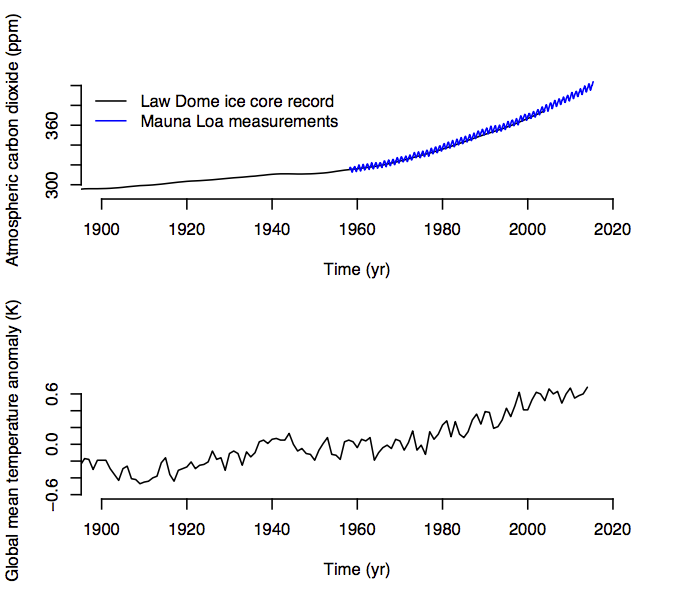

# Learning Goals

After completing this exercise, you should be able to

* explain the relationship between atmospheric carbon dioxide concentration, surface air temperature, and sea level
* download data from the Internet in R
* read data files into R
* make simple plots in R, including
    + plots with multiple panels
    + plots with multiple curves in the same panel

# Introduction

This textbook on climate risk management will discuss sea level rise extensively.  Many people live near present-day sea level (e.g., Nicholls et al., 2008), and rises in sea level expose these people to the possibility of flooding.  For example, the ongoing increase in sea level will likely cause communities on the United States' eastern coast to experience frequent flooding within the next few decades (Spanger-Siegfried et al., 2014).  

Sea level rise is caused by temperature increases, which in turn are driven by increases in carbon dioxide concentrations in the atmosphere.  Carbon dioxide is produced by human activities and natural processes.  Increases in carbon dioxide concentrations in the atmosphere enhance the trapping of infrared radiation near the Earth's surface and contribute to rises in surface air temperatures.  As the ocean absorbs some of the excess heat from the atmosphere, its temperature increases, causing it to expand and causing sea level rise.  Temperature increases cause melt of glaciers and ice sheets, which leads to sea level rise by adding mass to the oceans.  

Data covering the last century support this relationship between atmospheric carbon dioxide concentrations, temperature, and sea level (Fig. 1).  The curves in the three panels of Figure 1 rise together, suggesting that these variables are related.  Although correlation does not prove causation, the combination of a clear relationship between variables with a plausible explanation for why they should be related is a strong argument for causation.  

Frequent, accurate measurements of carbon dioxide in the atmosphere began in the late 1950s at Mauna Loa in Hawaii (Keeling et al., 1976; blue curve in Fig. 1, top panel).  These measurements show an annual cycle that represents Northern Hemisphere seasons.  Plants lose their leaves or die during the winter, releasing carbon dioxide to the atmosphere.  The Northern Hemisphere has much more land, and therefore more plants,  than the Southern Hemisphere.  Thus, the Northern Hemisphere's seasons largely control the variability in atmospheric carbon dioxide concentrations within any individual year.  However, there is a definite upward trend in this curve that is larger than the amplitude of the annual cycle.   

Measurements of former atmospheric compositions from bubbles trapped in ice cores allow us to extend the observational record of carbon dioxide concentrations farther back in time (MacFarling Meure et al., 2006; black curve in Fig. 1, top panel).  As snow falls on the Greenland and Antarctic ice sheets, it traps samples of the atmosphere.  Because new snow buries and compresses old snow, the time at which different snow samples fell can be estimated by counting the layers in an ice sheet.  The ice core measurements of atmospheric carbon dioxide concentrations are less finely resolved in time than the direct measurements, and therefore don't reflect the annual cycle of CO~2~ in the atmosphere.  However, the trend of the ice core data is similar to that of the direct observations during the period when they overlap, suggesting that the ice core data are reliable.  

Because carbon dioxide mixes readily in the atmosphere, measurements of atmospheric carbon dioxide concentrations at most places on the Earth's surface are relatively representative of the globe as a whole.  In contrast, both surface air temperatures and sea levels are measured at widely dispersed stations and must be aggregated to give a global mean value.  Global mean temperatures must be estimated from individual weather stations with long records (Hansen et al., 2010); past sea levels are estimated using data from tide gages (Jevrejeva et al., 2014).  As one might expect, there are various methods for performing this aggregation, and the different methods give somewhat different answers.  However, it seems clear that both global mean surface air temperature and global mean sea level are rising.  

In this lab exercise, you'll examine an R script that downloads the data files needed to make the top two panels of Figure 1 from the Internet and plots them.  You'll then modify the script so that it plots all three panels of Figure 1.  

***


**Figure 1.** Atmospheric carbon dioxide concentrations (top panel), surface air temperature change (middle panel), and sea level change (bottom panel), between 1900 and ~2015.  All three quantities rise over this period, suggesting a causal relationship between them.  See text for discussion.  

***

# Tutorial

We'll start by looking at several Web pages that describe the data we'll be using in this exercise.  As of May 2015, the various data sets displayed in Figure 1 are archived in the following places:

**Table 1.**  Internet sources of data used in Exercise #1 and associated references.  NOAA, National Oceanic and Atmospheric Administration; DOE CDIAC, United States Department of Energy -- Carbon Dioxide Analysis Center; NASA GISS, National Aeronautics and Space Administration -- Goddard Institute for Space Studies; PSMSL, Permanent Service for Mean Sea Level.  

Data type                      | Reference                      | Location on the Web
------------------------------ | ------------------------------ | ---------------------------------
CO~2~, direct measurements     | Keeling et al. (1976)          | [NOAA](http://www.esrl.noaa.gov/gmd/ccgg/trends/)
CO~2~, Law Dome ice core       | MacFarling Meure et al. (2006) | [DOE CDIAC](http://cdiac.ornl.gov/trends/co2/modern_co2.html)
Surface air temperature change | Hansen et al. (2010)           | [NASA GISS](http://data.giss.nasa.gov/gistemp/)
Sea level anomaly              | Jevrejeva et al. (2014)        | [PSMSL](http://www.psmsl.org/products/reconstructions/jevrejevaetal2014.php)

Click on the links in the right-hand column of Table 1 and look at the descriptions of the data stored there.  Also look for links to the particular data sets mentioned in the Introduction.  Some Web pages contain links to multiple data sets; we want the "[Mauna Loa CO~2~ monthly mean data](ftp://aftp.cmdl.noaa.gov/products/trends/co2/co2_mm_mlo.txt)," [the Law Dome data](ftp://ftp.ncdc.noaa.gov/pub/data/paleo/icecore/antarctica/law/law2006.txt) (scroll down to near the bottom of the page), and the "[global-mean monthly, seasonal, and annual means, 1880-present, updated through most recent month](http://data.giss.nasa.gov/gistemp/tabledata_v3/GLB.Ts+dSST.txt)" of the "Land-Ocean Temperature Index, LOTI."  

## Executing a sample R script, `lab1_sample.R`

Put the file `lab1_sample.R` in an empty directory.  Open this file in RStudio and look at the contents.  This script carries out the following tasks:

* Clears the workspace by deleting any variables already in R and closing any open figures
* Downloads data files describing atmospheric carbon dioxide concentrations and surface air temperature anomalies
* Reads the data from these files into R
* Makes plots of these time series

With `lab1_sample.R` open in RStudio, choose `Session > Set Working Directory > To Source File Location` in the menu bar near the top of the screen.  This step ensures that R knows where to put the files that will be downloaded when we run the script.  

Try executing `lab1_sample.R` by clicking on the `Source` button in the upper right-hand corner of the script window in RStudio.  You should see two new folders in the directory where `lab1_sample.R` is.  One of these new folders, `data`, should contain some text files; the other, `figures`, will contain a `.pdf` file (Fig. 2).  

***



**Figure 2.** Contents of `data/lab1_sample_plot1.pdf` after running `lab1_sample.R`.  See text for discussion.  

***

## Looking in detail at `lab1_sample.R`

So, now we know what `lab1_sample.R` does: it makes two directories and puts some files in each of them.  In particular, the `figures` directory contains a `.pdf` file with a figure.  But, how does it work, and where is the third panel of Figure 1?  In this section, we'll go through `lab1_sample.R` in detail.  In the Exercise, you'll modify `lab1_sample.R` so that the figure it produces contains all three panels of Figure 1.  

The top few lines of `lab1_sample.R` are comments:

```{r eval = FALSE}
# lab1_sample.R
# Patrick Applegate, patrick.applegate@psu.edu
#
# Downloads data on atmospheric carbon dioxide concentration and global mean
# temperature and makes plots of these quantities.  
```

It's a good idea to begin your R scripts with comments like this one.  

The next few lines read

```{r eval = FALSE}
# Clear away any existing variables or figures.  
rm(list = ls())
graphics.off()
```

These lines clear any existing variables from memory and close any figures that you may have open in the Figure window in RStudio.  Including these lines at the beginnings of your R scripts can help you avoid mistakes.  

The next block of lines makes a new directory called `data` and downloads some files into it.  

```{r eval = FALSE, tidy = TRUE}
# Create a directory called data and download some files into it.  
dir.create('data')
download.file('ftp://aftp.cmdl.noaa.gov/products/trends/co2/co2_mm_mlo.txt', 'data/co2_mm_mlo.txt', method = 'curl')
download.file('ftp://ftp.ncdc.noaa.gov/pub/data/paleo/icecore/antarctica/law/law2006.txt', 'data/law2006.txt', method = 'curl')
download.file('http://data.giss.nasa.gov/gistemp/tabledata_v3/GLB.Ts.txt', 'data/GLB.Ts.txt', method = 'curl')
```

The command `dir.create('data')` creates a directory with a particular name, in this case `data`, in the present working directory.  Note that the directory name needs to be enclosed in quotation marks, `' '`.  

For details on the `download.file()` command, type `help(download.file)` in the Console window and press Enter.  The help file gives a short description of what the command does, then gives its syntax (under "Usage"), and then a description of the arguments.  In this case, we see

```{r eval = FALSE, tidy = TRUE}
download.file(url, destfile, method, quiet = FALSE, mode = "w", cacheOK = TRUE, extra = getOption("download.file.extra"))
```

Only the first few "words" in the parentheses (`url`, `destfile`, and `method`) will matter in this exercise.  These words are arguments of the `download.file()` function.  Look at the explanations of what these arguments mean in the help file.  Now look back at the code block above.  Can you see why the code looks the way it does?  

In the line

```{r eval = FALSE, tidy = TRUE}
download.file('ftp://aftp.cmdl.noaa.gov/products/trends/co2/co2_mm_mlo.txt', 'data/co2_mm_mlo.txt', method = 'curl')
```

the first group of characters in quotation marks is the Internet location of the file we want to download (the `url` argument for `download.file()`), and the second group of characters in quotation marks is where we want to put the downloaded file (`destfile`).  The `method` argument should be set to `curl` on Macintosh machines; other types of computers may need different values.  Check the `download.file()` help file if you run into problems.  

Now that we have the files, we need to read the information that they contain into R using the `read.table()` command.  Open each of the data files using TextWrangler or a similar text editor and examine them.  Which files contain "extra" information at the top or bottom of the file?  In each file, which columns contain the information we need?  

In `lab1_sample.R`, the following lines read in the atmospheric CO~2~ concentration data from the Mauna Loa and Law Dome records.  

```{r eval = FALSE, tidy = TRUE}
# Read in the information from the downloaded files.  
loa.co2.data <- read.table('data/co2_mm_mlo.txt', skip = 57, header = FALSE)
law.co2.data <- read.table('data/law2006.txt', skip = 183, nrows = 2004, header = FALSE)
```

In each of the `read.table()` commands, the first argument is the file to open.  Look at the help file for `read.table()`.  What do the `skip` and `nrows` arguments do?  Look back at the corresponding files in your text editor.  Can you see why these arguments have the values that they do?  

The temperature data file is formatted in blocks, each of which contains about 20 yr of data.  For that reason, it is much more complicated to read into R.  The code block below accomplishes this task.  We won't discuss how this code block works here; it requires the use of `for` loops, which we'll cover in a future lesson.  

```{r eval = FALSE, tidy = TRUE}
# Reading in the GISS temperature data is somewhat harder.  
begin.rows <- c(9, 31, 53, 75, 97, 119, 141)
num.rows <- c(19, 20, 20, 20, 20, 20, 14)
temp.data <- matrix(NA, nrow = sum(num.rows), ncol = 20)
temp.data[1: num.rows[1], ] <- as.matrix(read.table('data/GLB.Ts+dSST.txt', skip = begin.rows[1], nrows = num.rows[1], header = FALSE))
for (i in 2: length(begin.rows)) {
  temp.data[(sum(num.rows[1: i- 1])+ 1): sum(num.rows[1: i]), ] <- as.matrix(read.table('data/GLB.Ts+dSST.txt', skip = begin.rows[i], nrows = num.rows[i], header = FALSE))
}
```

Finally, we make a figure and send it to a .pdf file.  

```{r eval = FALSE, tidy = TRUE}
# Make a plot of the results.  
dir.create('figures')
pdf('figures/lab1_sample_plot1.png', width = 4.5, height = 4)
par(mfrow = c(2, 1), cex = 0.66)
plot(law.co2.data[, 1], law.co2.data[, 6], type = 'l', xlim = c(1900, 2020), ylim = c(290, 400), bty = 'n', xlab = 'Time (yr)', ylab = 'Atmospheric carbon dioxide (ppm)')
lines(loa.co2.data[, 3], loa.co2.data[, 5], type = 'l', col = 'blue')
legend('topleft', c('Law Dome ice core record', 'Mauna Loa measurements'), col = c('black', 'blue'), lwd = 1, bty = 'n')
plot(temp.data[, 1], temp.data[, 14]/ 100, type = 'l', xlim = c(1900, 2020), ylim = c(-0.6, 0.7), bty = 'n', xlab = 'Time (yr)', ylab = 'Global mean temperature anomaly (K)')
dev.off()
```

As before, `dir.create()` makes a directory, this time called `figures`.  The `pdf()` and `dev.off()` commands open a new `.pdf` file and close this file once we are done writing to it.  The `width` and `height` arguments of the `pdf()` function determine the size of the resulting `.pdf` file.  If you forget to include `dev.off()` at the end of your plotting commands, your `.pdf` file may not open properly.  

The `plot()` command is the main plotting command in R.  Now that you've run `lab1_sample.R`, try pasting the following line of R code into the Console window in RStudio and press Enter:  

```{r eval = FALSE, tidy = TRUE}
plot(law.co2.data[, 1], law.co2.data[, 6], type = 'l', xlim = c(1900, 2020), ylim = c(290, 400), bty = 'n', xlab = 'Time (yr)', ylab = 'Atmospheric carbon dioxide (ppm)')
```

A figure should appear in the Plots window in RStudio.  The curve in this plot represents the Law Dome CO~2~ record.  The first two arguments represent the independent variable (in this case, time, as contained in the first column of `law.co2.data`), and the dependent variable (CO~2~ concentrations, as contained in the sixth column of `law.co2.data`).  

To see why the figure looks the way it does, look at `help(plot)` and `help(par)`.  What do the other arguments in the call to `plot()`, above, do?  How does the plot change if you adjust the values of those arguments?  

If you get an error instead of a figure, you may not have run `lab1_sample.R` properly.  Make sure that  

1. `lab1_sample.R` is open and visible in RStudio's script window
2. you have clicked `Session > Set Working Directory > To Source File Location` in the menu bar near the top of the screen
3. you have clicked the Source button in the upper right-hand corner of the script window

Good scientific graphics help the reader to compare different pieces of data (Tufte, 2001).  To achieve this goal, we often need to make a figure with two or more panels, or to draw two data series on the same set of axes.  A quick summary of how to carry out these tasks might look like this:  

* **Make a plot with two or more panels:** Before issuing your first `plot()` command, use the `par()` command with arguments `mfcol` or `mfrow` to determine how many panels the figure will have.  
* **Plot two data series on the same set of axes:** Issue the `plot()` command to plot the first data series, then use the `lines()` or `points()` commands to plot subsequent data series.  Note that the data series that is displayed first will be under the second, and so forth.  

`lab1_sample.R` applies both of these methods.  In the code block below, we first issue the `par(mfrow = c(2, 1))` command to tell R that we want to make a plot with two panels, one on top of the other.  We then issue the `plot()` command to display the Law Dome CO~2~ record in the top panel.  The subsequent call to `lines()` displays the Mauna Loa CO~2~ measurements in the same panel as the Law Dome record.  

```{r eval = FALSE, tidy = TRUE}
par(mfrow = c(2, 1), cex = 0.66)
plot(law.co2.data[, 1], law.co2.data[, 6], type = 'l', xlim = c(1900, 2020), ylim = c(290, 400), bty = 'n', xlab = 'Time (yr)', ylab = 'Atmospheric carbon dioxide (ppm)')
lines(loa.co2.data[, 3], loa.co2.data[, 5], type = 'l', col = 'blue')
```

Issuing a second `plot()` commands would cause its output to appear in the lower panel.  If we then used a third `plot()` command, the figure we were making would be erased, and the output of the third `plot` command would appear in the top panel of the new figure.  

Finally, we add a legend to the top panel of our figure with the following line of code.  

```{r eval = FALSE, tidy = TRUE}
legend('topleft', c('Law Dome ice core record', 'Mauna Loa measurements'), col = c('black', 'blue'), lwd = 1, bty = 'n')
```

`help(legend)` explains how this command works.  Scroll down to `Details` and note that the first argument `x` can be set to any of various words that tell R where to put the legend.  

# Exercise

Save `lab1_sample.R` to a new file.  Now, using what you've learned from following the detailed discussion of `lab1_sample.R` above, modify the new file so that it produces a `.pdf` file like Figure 1, with three panels.  The bottom panel should show the sea level anomalies from Jevrejeva et al. (2014).  Specifically, you'll need to add commands to your new file that

1. download the sea level anomaly data from Jevrejeva et al. (2014) to your `data` folder (have a look at Table 1)
2. read in this data to a new variable (you might name your new variable `sl.data`)
3. causes the figure to have three panels instead of two
4. adjusts the size of the resulting `.pdf` file
5. plots the sea level anomaly data in the bottom panel

Make sure that the lower panel of your plot has sensible axis limits in the x and y directions, as well as descriptive labels for the axes (see Fig. 1 for an example).  Also be sure to update the comments at the top of your file.  

# Questions

**ADD QUESTIONS HERE: How large are the changes in Figure 1?  How do the magnitudes of these changes compare to the magnitude of changes since the Last Glacial Maximum?  How do the rates compare to the rate of change since the LGM?**  

# References

Hansen, J., Ruedy, R., Sato, M., and Lo, K., 2010.  Global surface temperature change.  Reviews of Geophysics 48, RG4004.  

Jevrejeva, S., Moore, J. C., Grinsted, A., Matthews, A., Spada, G., 2014.  Trends and acceleration in global and regional sea levels since 1807.  Global and Planetary Change 113, 11-22.  

Keeling, C. D., Bacastow, R. B., Bainbridge, A. E., Ekdahl, C. A., Guenther, P. R., and Waterman, L. S., 1976.  Atmospheric carbon dioxide variations at Mauna Loa Observatory, Hawaii.  Tellus 28, 538-551.  

MacFarling Meure, C., Etheridge, C., Trudinger, C., Steele, P., Langenfelds, R., van Ommen, T., Smith, A., and Elkins, J., 2006.  The Law Dome CO2, CH4 and N2O ice core records extended to 2000 years BP.  Geophysical Research Letters 33, L14810.  

Nicholls, R. J., Tol, R. S. J., and Vafeidis, A. T., 2008.  Global estimates of the impact of a collapse of the West Antarctic ice sheet: an application of FUND.  Climatic Change 91, 171-191.  

Tufte, E. R., 2001.  The Visual Display of Quantitative Information.  Graphics Press, 197.  

Spanger-Siegfried, E., Fitzpatrick, M., and Dahl, K., 2014.  Encroaching tides: how sea level rise and tidal flooding threaten U.S. East and Gulf Coast communities over the next 30 years.  Union of Concerned Scientists, 66.  
